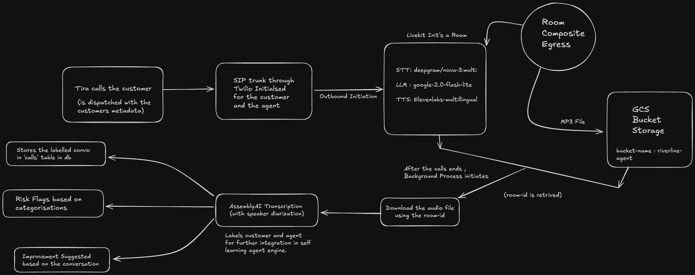

<div align="center">
  
  
  # Tira 🤖
  
  > **Intelligent AI Collections Agent with Self-Learning Capabilities**
  
  [](https://python.org)
  [](https://livekit.io)
  [](https://supabase.com)
  [](https://cloud.google.com)
  [](LICENSE)
  
  *Empathetic • Compliant • Continuously Improving*
</div>

Tira is an advanced AI voice agent designed for debt collection calls, featuring automated self-improvement through LLM-as-a-Judge evaluation. Built with LiveKit, Supabase, and Google Gemini, Tira provides empathetic, compliant, and continuously improving customer interactions.

## 🏗️ Architecture Overview



## 🔄 Self-Learning Flow


## ✨ Key Features

<table>
<tr>
<td width="50%">

### 🎯 **Voice Intelligence**
- **Outbound calling** via LiveKit Telephony
- **Real-time conversation** management
- **Multi-language support** with turn detection
- **Background noise cancellation**

### 🧠 **Self-Learning AI**
- **Automated prompt improvement** with LLM-as-a-Judge
- **8 customer persona evaluation** framework
- **Performance assessment** and scoring
- **Continuous optimization** cycle

</td>
<td width="50%">

### 🔍 **Risk Analysis**
- **Financial hardship** detection
- **Payment agreement** tracking
- **Dispute identification** and handling
- **Abusive language** protection

### 🛡️ **Compliance & Safety**
- **FDCPA-compliant** conversation flow
- **Prompt validation** with rollback protection
- **Call recording** with Auto Egress
- **Secure data storage** in GCS

</td>
</tr>
</table>

## 🛠️ Tech Stack

- **Python 3.11+** - Core language
- **LiveKit Agents & Telephony** - Voice AI platform
- **Google Gemini** - LLM-as-a-Judge evaluation
- **Supabase** - Database & metadata storage
- **Google Cloud Storage** - Call recording storage
- **Twilio SIP Trunk** - Telephony integration
- **Regex-based text analysis** - Risk detection
- **Async/await architecture** - High performance

## 🚀 Quick Start

### 1. Clone and Setup

```bash
git clone git@github.com:lgsurith/Tira.git
cd Tira
uv sync
```

### 2. Environment Configuration

Copy `.env.example` to `.env.local` and configure:

```bash
cp .env.example .env.local
```

**Required Environment Variables:**
```bash
# LiveKit Configuration
LIVEKIT_URL=wss://your-livekit-url
LIVEKIT_API_KEY=your-api-key
LIVEKIT_API_SECRET=your-api-secret
LIVEKIT_SIP_TRUNK_ID=your-sip-trunk-id
LIVEKIT_AGENT_NAME=riverline-agent

# Google Gemini (for LLM-as-a-Judge)
GOOGLE_API_KEY=your-google-api-key

# Supabase Configuration
SUPABASE_URL=your-supabase-url
SUPABASE_ANON_KEY=your-supabase-anon-key
SUPABASE_SERVICE_ROLE_KEY=your-supabase-service-role-key
```

### 3. Download Required Models

```bash
uv run python src/agent.py download-files
```

### 4. Run the Agent

**Development Mode:**
```bash
uv run python src/agent.py dev
```

**Console Mode (for testing):**
```bash
uv run python src/agent.py console
```

### 5. Dispatch a Call

```bash
lk dispatch create \
  --new-room \
  --agent-name riverline-agent \
  --metadata '{"phone_number": "+1234567890", "customer_context": {"customer_name": "John Doe", "account_last4": "1234", "balance_amount": "1,500.00", "days_past_due": "30"}}'
```

## 🧠 Self-Learning System

### How It Works

1. **Call Analysis** → Risk Assessment
2. **Persona Evaluation** → Performance Scoring  
3. **LLM-as-a-Judge** → Improvement Suggestions
4. **Prompt Validation** → Safety Check
5. **Agent Update** → Deployment
6. **Performance Tracking** → Iteration

### Self-Learning CLI Commands

```bash
# Run self-learning cycle for a specific call
uv run python src/self_learning_cli.py run <room_id>

# Check current bot iteration status
uv run python src/self_learning_cli.py status

# List recent calls available for analysis
uv run python src/self_learning_cli.py calls

# Show help
uv run python src/self_learning_cli.py --help
```

### Example Usage

```bash
# Analyze a specific call and improve the agent
uv run python src/self_learning_cli.py run room-abc123

# Check which iteration is currently active
uv run python src/self_learning_cli.py status

# See available calls for analysis
uv run python src/self_learning_cli.py calls
```

## 📊 Customer Personas

Tira evaluates performance against 8 comprehensive customer personas:

1. **Cooperative Customer** - Willing to pay, responsive
2. **Financial Hardship Customer** - Experiencing money problems
3. **Disputing Customer** - Questions the debt validity
4. **Abusive Customer** - Uses offensive language
5. **Elderly Customer** - May need additional support
6. **Unemployed Customer** - Lost job, seeking alternatives
7. **Evasive Customer** - Avoids direct answers
8. **Payment Plan Customer** - Wants structured payment options

## 🎯 Risk Analysis

Tira automatically detects and flags:

- ✅ **Financial Hardship** - Bankruptcy, job loss, medical bills
- ✅ **Payment Agreements** - Customer commits to payment
- ✅ **Payment Refusals** - Customer refuses to pay
- ✅ **Disputes** - Questions debt validity
- ✅ **Abusive Language** - Offensive or threatening language
- ✅ **Wrong Number** - Incorrect contact information
- ✅ **Callback Requests** - Customer requests follow-up
- ✅ **Payment Plans** - Requests for structured payments

## 📹 Call Recording

### Auto Egress Setup

Tira automatically records all calls using LiveKit Egress:

```bash
# Create room with Auto Egress
./scripts/create_room_with_egress.sh

# List active recordings
./scripts/list_egress.sh

# Stop specific recording
./scripts/stop_egress.sh <egress_id>

# Test complete workflow
./scripts/test_auto_egress.sh
```

### Recording Storage

- **Format**: MP4 video with audio
- **Storage**: Google Cloud Storage (GCS) buckets
- **Metadata**: Stored in Supabase database
- **Access**: Via GCS console or API
- **Backup**: Automatic redundancy across GCS regions

## 🗄️ Database Schema

### Core Tables

- **`calls`** - Call metadata and transcripts
- **`call_analysis`** - Risk analysis and bot performance
- **`bot_iterations`** - Self-learning prompt versions
- **`bot_performance_metrics`** - Performance tracking
- **`test_scenarios`** - Customer persona definitions
- **`test_results`** - Evaluation results

## 🛡️ Compliance & Safety

### FDCPA Compliance

- ✅ **Professional greeting** and identity verification
- ✅ **Empathetic approach** to financial difficulties
- ✅ **Clear purpose** statement
- ✅ **Payment options** discussion
- ✅ **Dispute handling** procedures
- ✅ **Abusive language** protection

### Prompt Validation

- ✅ **Structure validation** - Ensures required sections
- ✅ **Content validation** - Checks for completeness
- ✅ **Length validation** - Prevents truncation
- ✅ **Placeholder validation** - Maintains dynamic content
- ✅ **Rollback protection** - Reverts on validation failure

## 🧪 Testing

### Run Tests

```bash
# Run all tests
uv run pytest

# Run specific test file
uv run pytest tests/test_agent.py

# Run with coverage
uv run pytest --cov=src
```

### Manual Testing

```bash
# Test specific call analysis
uv run python src/analyze_specific_call.py

# Test recent call analysis
uv run python src/analyze_recent_call.py
```

## 🚀 Deployment

### Docker Deployment

```bash
# Build image
docker build -t tira-agent .

# Run container
docker run -d --env-file .env.local tira-agent
```

### LiveKit Cloud Deployment

```bash
# Deploy to LiveKit Cloud
lk app deploy
```

## 📁 Project Structure

```
src/
├── agent.py                    # Main voice agent
├── self_learning_integration.py # Self-learning system
├── self_learning_cli.py        # CLI management
├── post_call_processing/       # Analysis services
│   ├── services/
│   │   ├── analysis_service.py # Risk analysis
│   │   ├── supabase_service.py # Database operations
│   │   └── transcription_service.py # Speech processing
│   ├── models/
│   │   └── call_data.py        # Data models
│   └── utils/
│       └── background_processor.py # Async processing
├── challenge2/                 # Persona evaluation
│   ├── llm_judge/
│   │   └── performance_evaluator.py # LLM-as-a-Judge
│   ├── scenarios/
│   │   └── customer_personas.py # Persona definitions
│   └── self_correction/
│       └── agent_improver.py   # Prompt improvement
└── scripts/                    # Utility scripts
    ├── create_room_with_egress.sh
    ├── list_egress.sh
    ├── stop_egress.sh
    └── test_auto_egress.sh
```

## 🤝 Contributing

1. Fork the repository
2. Create a feature branch: `git checkout -b feature/amazing-feature`
3. Commit changes: `git commit -m 'Add amazing feature'`
4. Push to branch: `git push origin feature/amazing-feature`
5. Open a Pull Request

### Development Guidelines

- Follow Python best practices
- Add tests for new features
- Update documentation
- Ensure prompt validation
- Test with multiple personas

## 📄 License

This project is licensed under the MIT License - see the [LICENSE](LICENSE) file for details.

## 🆘 Support

- **Issues**: [GitHub Issues](https://github.com/lgsurith/Tira/issues)
- **Documentation**: [LiveKit Docs](https://docs.livekit.io/agents/)
- **Community**: [LiveKit Discord](https://discord.gg/livekit)

## 🎥 Demo

[Add Loom video link here]

---

<div align="center">

### 🌟 **Built with Cutting-Edge Technology**


---

**🤖 Tira - Revolutionizing Debt Collection with AI**

*Empathetic • Compliant • Continuously Improving*

[](https://github.com/lgsurith/Tira)
[](https://github.com/lgsurith/Tira)

</div>